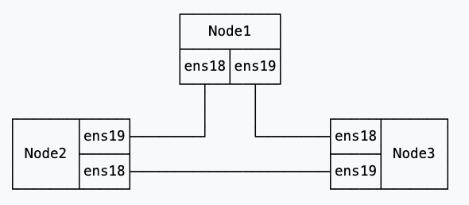

# Proxmox High availability Cluster with Ceph

## SERVER CONFIGURATION

### HARDWARE REQUIRED
#### 3 of these servers are needed, each one has the same configuration

- HP Z440 --> [GEKKO Computer GmbH](https://www.ebay.de/sch/i.html?_dkr=1&iconV2Request=true&_blrs=recall_filtering&_ssn=gekko-computer&store_cat=0&store_name=gekkocomputergmbh&_oac=1&_nkw=hp%20z440)
- 4x 32GB 128GB RAM RDIMM ECC REG DDR4 2400 MHz [24H MEMORY STORE](https://www.ebay.de/itm/364823772159)
- Intel Xeon CPU e5-2680 v4 14 Core 14x 2,4 GHz  [24H MEMORY STORE](https://www.ebay.de/itm/354889256274)
- HP Z440 COOLING SOLUTION MEMORY FAN ADAPTER [WORKSTATION4U](https://www.ebay.de/itm/265422073808)
  - this fan are bit too loud, [you may want to replace](hpz440_memory_cooling_fans_connector.md) them with [Noctua NF-A6x25 PWM](https://www.galaxus.ch/en/s1/product/noctua-nf-a6x25-pwm-60-mm-1-x-pc-fans-5812186?supplier=406802))
- Network card [MCX416A-CCAT Mellanox ConnectX-4 Dual Port 100GbE QSFP28](https://www.ebay.de/itm/355941441991)
- Network cables 1x1m, 2x0.5m [QSFP28 to QSFP28 100Gb DAC Cable 0.5m](https://www.aliexpress.com/item/1005006997468085.html?spm=a2g0o.order_detail.order_detail_item.4.54176368jFln74)
- Graphics card ( required only for isntallation and maintanance )
  - [ASUS GT730-4H-SL-2GD5 (2 GB)](https://www.galaxus.ch/en/s1/product/asus-gt730-4h-sl-2gd5-2-gb-graphics-card-16699108?supplier=406802), its a PCI X4, since no other slots are available  
- [ICY BOX NVMe M.2 SSD to PCIe 4.0 X4](https://www.amazon.de/-/en/gp/product/B094YBFZWV/ref=ppx_yo_dt_b_search_asin_title?ie=UTF8&psc=1)
- [Kingston FURY Renegade NVME 1GB](https://www.galaxus.ch/en/s1/product/kingston-fury-renegade-1000-gb-m2-2280-ssd-17274250?supplier=406802) 
- SAS CONTROLLER ( to connect an external Disk Enclosure) 
  - [Avago LSI SAS 9207-8e SATA / SAS HBA 8port Controller extern 6Gbps PCIe x8 3.0](https://www.haehnlein-it.com/Avago-LSI-SAS-9207-8e-SATA-SAS-HBA-8port-Controller-extern-6Gbps-PCIe-x8-3.0/REF-LSI00300)
- [SAS CABLE 8088](https://www.amazon.de/-/en/gp/product/B01N95BL8R/ref=ppx_yo_dt_b_search_asin_title?ie=UTF8&th=1) ( connection from the Server to the enclosure)
- Adapter to convert Mini SAS for external use to MIni sas for internal use
  - [Dual Ports Mini SAS SFF-8088 to SAS 36Pin SFF-8087 ](https://www.amazon.de/-/en/gp/product/B06ZZDLJH6/ref=ppx_yo_dt_b_search_asin_title?ie=UTF8&th=1)
- Cable from the adapter to the enclosure ( 12GB Mini Sas )
  - [Mini SAS SFF-8643 to Mini SAS 36Pin SFF-8087 Internal HD Mini SAS to Mini SAS Cable (8643 to 8087)](https://www.amazon.de/-/en/gp/product/B07SLXPB99/ref=ppx_yo_dt_b_search_asin_title?ie=UTF8&psc=1)
- Hdd enclosure 
  - [ICY Box IB-564SAS-12G 4x 3,5" SATA/SAS HDD](https://www.ebay.de/itm/234783572316) 

### NETWORK CONNECTIONS
As explained [here in Full mesh Network for Ceph Server](https://pve.proxmox.com/wiki/Full_Mesh_Network_for_Ceph_Server) 
the network connection will be as follow, where the links are done through 100Gb network using
Mellanox ConnectX-4 100GbE and QSFP28 cables

Additionally to that each server uses his 1GB network cable ( motherboard network controller)
to connect to the local lan for the web interface / web administration interface.

## LXC CONTAINERS
### INFLUX DB INSTALLATION